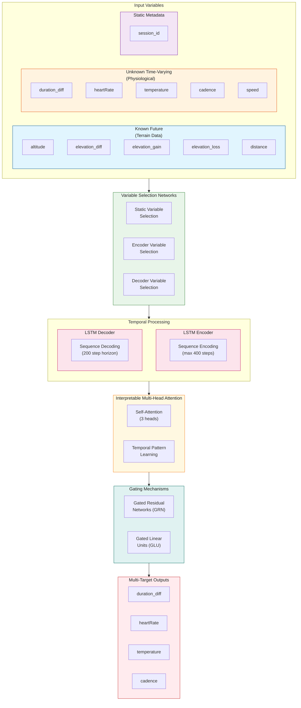

# Trail Running TFT Predictor

## Application of Temporal Fusion Transformer to Trail Running Predictions

A deep learning project using **Temporal Fusion Transformers (TFT)** to predict trail running race duration and physiological metrics from sensor data. Built with PyTorch Lightning and the pytorch-forecasting library as part of a Master's degree thesis in Artificial Intelligence (MMIA).

## Project Overview

The goal of this project is to predict race completion time for ultra-trail running events (3-6 hour duration) using time series data from sports watches. The model handles **cold-start scenarios**, meaning it can make predictions from the very beginning of a race without requiring prior running data from that session.

### Key Features

- **Multi-target forecasting**: Simultaneously predicts `duration_diff`, `heartRate`, `temperature`, and `cadence`
- **Cold-start inference**: Uses synthetic weighted encoders based on historical sessions to predict from race start
- **Distance-domain resampling**: Converts time-series to distance-based samples (5m intervals) for consistent predictions
- **Sliding window chunking**: Enables sequential prediction chains across entire race distances
- **Transfer learning**: V3 model supports fine-tuning with Garmin FIT data after pre-training on Polar data (upcoming)

### Data Sources

1. **Polar Vantage V** (Primary training data): JSON exports from Polar Flow
2. **Garmin Fenix 7 Pro** (Fine-tuning data): FIT files with [NutritionLogger](https://github.com/ericmaster/NutritionLogger) app data including RPE, nutrition intake, and high-frequency accelerometer/gyroscope data

## Installation

```bash
# Clone the repository
git clone https://github.com/ericmaster/tft-predictor.git
cd tft-predictor

# Install dependencies
pip install -r requirements.txt
```

### Requirements

- Python 3.10+
- PyTorch Lightning
- pytorch-forecasting
- pandas, numpy, matplotlib
- fitparse (for Garmin FIT files)
- scipy (for spectral feature extraction)

## Usage

### Data Processing Pipeline

```bash
# Step 1: Process raw Polar JSON files
python utils/data_processor.py

# Step 2: Resample to distance domain (5m intervals)
python utils/data_resampling.py

# For Garmin FIT files (single-step pipeline)
python utils/fit_data_processor.py
```

### Training

```bash
# Train the TFT model (auto-resumes from checkpoint)
python training.py
```

### Analysis

The main analysis workflow is in `tft-notebook.ipynb`, which includes:
- Data exploration and visualization
- DataModule setup and batch inspection
- Learning rate finder
- Hyperparameter optimization with Optuna
- Model evaluation and cold-start inference testing

## Directory Structure

```
.
├── data/
│   ├── full-data/           # Raw Polar JSON files
│   ├── long-tr-data/        # Processed Polar CSVs with features
│   ├── resampled/           # Distance-domain resampled CSVs (model input)
│   ├── fitfiles/            # Raw Garmin FIT files
│   ├── fit-processed/       # Processed Garmin CSVs
│   └── fit-resampled/       # Resampled Garmin CSVs (model input)
│
├── lib/                     # Core library modules
│   ├── data.py              # TFTDataModule for training/validation/test splits
│   ├── data_v3.py           # DataModule V3 for Garmin fine-tuning
│   ├── model.py             # TrailRunningTFT model implementation
│   └── model_v3.py          # Model V3 with transfer learning support
│
├── utils/                   # Utility scripts
│   ├── data_processor.py    # Polar JSON → CSV conversion
│   ├── data_resampling.py   # Time → Distance domain resampling
│   ├── fit_data_processor.py # Garmin FIT file processing
│   ├── viz.py               # Visualization utilities
│   └── results.py           # Cold-start inference summary functions
│
├── checkpoints/             # Model checkpoints (best validation loss)
├── logs/                    # Training logs and metrics
├── lightning_logs/          # PyTorch Lightning default logs
│
├── training.py              # Main training script
├── training_v3.py           # V3 fine-tuning training script
├── hyperparameter_optimization.py  # Optuna hyperparameter search
├── tft-notebook.ipynb       # Main analysis notebook
└── requirements.txt         # Python dependencies
```

## Library Modules (`lib/`)

### `data.py` - TFTDataModule

PyTorch Lightning DataModule for the Temporal Fusion Transformer with pytorch-forecasting.

**Key features:**
- Session-based train/val/test splits (75/15/10) to prevent data leakage
- Group normalization per session using `GroupNormalizer`
- Sliding window chunking for cold-start evaluation
- Configurable encoder/prediction lengths
- Multi-target support: `duration_diff`, `heartRate`, `temperature`, `cadence`

**Key parameters:**
- `min_encoder_length`: Minimum encoder length (1 for cold-start)
- `max_encoder_length`: Maximum context window (default: 400)
- `max_prediction_length`: Prediction horizon (default: 200 steps = 1km)
- `use_sliding_windows`: Enable overlapping chunks for inference
- `cold_start_weight`: Emphasis on cold-start training samples

### `data_v3.py` - TFTDataModuleV3

Extended DataModule for fine-tuning with Garmin FIT data.

**Key differences from V1:**
- Handles sparse nutritional/RPE fields
- Manual session split for small datasets (5/1/1 train/val/test)
- Fills missing temperature with synthetic constant
- Includes new features: `rpe`, `water_intake`, `electrolytes_intake`, `food_intake`

### `model.py` - TrailRunningTFT

Custom Temporal Fusion Transformer extending pytorch-forecasting's TFT.

**Key features:**
- Multi-target forecasting with `MultiLoss` (weighted SMAPE)
- `AsymmetricSMAPE`: Custom loss that penalizes under-predictions more (alpha=0.51)
- Duration-weighted loss emphasizing the primary target
- Configurable hidden sizes, attention heads, and regularization

**Target weights (default):**
- `duration_diff`: 85%
- `heartRate`, `temperature`, `cadence`: 5% each

### `model_v3.py` - TrailRunningTFTV3

Transfer learning model for fine-tuning with Garmin data.

**Key features:**
- Load pre-trained V2 weights with partial matching
- Layer freezing strategies (encoder, variable selection)
- Lower learning rate (1e-6) and higher regularization for fine-tuning
- Higher dropout (0.30) to prevent overfitting on small datasets

## Utility Scripts (`utils/`)

### `data_processor.py` - DataProcessor

Processes raw Polar JSON files into structured CSV format.

**Processing steps:**
- Filters exercises: TRAIL_RUNNING, 3-6 hours, year ≥ 2020, avg_speed ≥ 3.0 m/s
- Extracts sensor samples: heartRate, altitude, distance, temperature, cadence, speed
- Feature engineering: distance differences, elevation gain/loss, smoothed altitude
- Batch processing with progress tracking and multithreading support

### `data_resampling.py` - DataResampler

Converts time-domain data to distance-domain (5m intervals).

**Processing steps:**
- Interpolates missing values (heartRate, speed, cadence, altitude, temperature)
- Removes duplicate distances
- Resamples to 5-meter intervals using linear interpolation
- Calculates fatigue proxy features: `avg_heart_rate_so_far`, `elevation_gain_of_last_100m`, `elevation_loss_of_last_100m`
- Adds `time_idx` (sequential index) and `session_id_encoded` (integer ID)

### `fit_data_processor.py` - FitDataProcessor

Single-step pipeline for Garmin FIT files (processing + resampling).

**Key features:**
- Extracts record messages (1 Hz): HR, altitude, distance, speed, cadence, power, GPS
- Extracts NutritionLogger developer fields: RPE, water/electrolytes/food intake counters
- Corrects accidental intake counter changes (reverted within 10s)
- Processes high-frequency sensor data (100 Hz accelerometer/gyroscope)
- Computes spectral features: PSD in 3 frequency bands, dominant frequency, spectral entropy
- Resamples to 5m intervals with proper handling of sparse fields

### `viz.py` - Visualization Utilities

Comprehensive visualization functions for training and evaluation.

**Key functions:**
- `plot_metrics()`: Training/validation loss curves from CSV logs
- `extract_hparams()`: Parse hyperparameters from YAML files
- `plot_session_overview()`: Multi-variable session visualization
- `visualize_predictions()`: Actual vs predicted comparison plots
- `plot_accumulated_duration_error()`: Error evolution over distance
- `cold_start_inference()`: Complete cold-start evaluation pipeline

### `results.py` - Results Summary

Functions for summarizing cold-start inference results.

**Key functions:**
- `print_cold_start_summary()`: Formatted summary statistics
- Per-chunk MAE metrics
- Error at key distance checkpoints (25%, 50%, 75%, 100%)

## Model Architecture

The Temporal Fusion Transformer (TFT) architecture includes:

- **Variable Selection Networks**: Automatically select relevant features
- **LSTM Encoder/Decoder**: Capture temporal dependencies
- **Interpretable Multi-Head Attention**: Learn long-range dependencies
- **Gating Mechanisms**: Control information flow



### Architecture Components

| Component | Description | Configuration |
|-----------|-------------|---------------|
| **Variable Selection** | Learns which inputs are relevant for each prediction | Separate networks for static, encoder, decoder |
| **LSTM Encoder** | Processes historical context | Max 400 time steps (2km history) |
| **LSTM Decoder** | Generates future predictions | 200 step horizon (1km ahead) |
| **Multi-Head Attention** | Captures long-range temporal dependencies | 3 attention heads |
| **Gated Residual Networks** | Controls information flow with skip connections | Hidden size: 45 |
| **Quantile Outputs** | Produces point predictions with uncertainty | 4 targets simultaneously |

**Input variables:**
- **Known future** (terrain data, available at prediction time): `altitude`, `elevation_diff`, `elevation_gain`, `elevation_loss`, `distance`
- **Unknown time-varying** (physiological/environmental): `duration_diff`, `heartRate`, `temperature`, `cadence`, `speed`, `duration`

## Citation

If you use this work, please cite:

```bibtex
@mastersthesis{aguayo2025tft,
  title={Application of Temporal Fusion Transformer to Trail Running Predictions},
  author={Aguayo, Eric},
  year={2025},
  school={USFQ - Universidad San Francisco de Quito},
  type={Master's Thesis}
}
```

## License

This project is licensed under the MIT License - see the [LICENSE](LICENSE) file for details.
